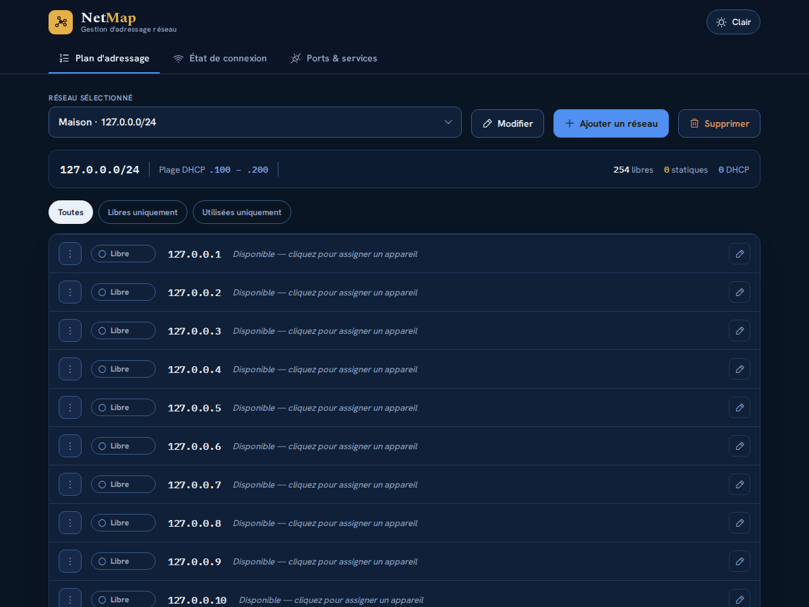

# NetMap — Gestion & surveillance d'adressage réseau

Application web auto-hébergée pour cartographier vos réseaux (plan d'adressage,
appareils, ports/services) et **surveiller automatiquement l'état de connexion
de chaque appareil par ping ICMP réel**.

Conçue pour tourner en continu sur un **Raspberry Pi 5 sous Ubuntu Server**, avec
une vraie base de données, le tout dans **Docker** (`docker compose up`).
Accessible en **local** comme via **Tailscale**.



---

## 🚀 Démarrage rapide

```bash
cp .env.example .env       # puis mettez-y votre mot de passe (voir « 🔐 Accès »)
docker compose up -d --build
```

Puis ouvrez l'interface :

- En local sur le Pi : `http://localhost:8000`
- Depuis un autre appareil du LAN : `http://IP-DU-PI:8000` (ex. `http://192.168.1.30:8000`)
- Via Tailscale : `http://IP-TAILSCALE-DU-PI:8000` (ex. `http://100.x.y.z:8000`)

> Le mode réseau `host` fait que le conteneur partage la pile réseau du Pi :
> l'interface est donc joignable sur **toutes** les adresses du Pi (LAN + Tailscale),
> et les pings atteignent aussi bien le LAN que le réseau Tailscale.

Au premier lancement, **tout est vide** : aucun réseau, aucune adresse. Vous
partez de votre propre base en cliquant sur **« Créer mon premier réseau »**.

Pour arrêter / redémarrer / voir les logs :

```bash
docker compose down            # arrêter
docker compose restart         # redémarrer
docker compose logs -f netmap  # suivre les logs (utile pour voir les pings)
```

---

## 🔐 Accès (mot de passe)

L'interface est protégée par **un seul mot de passe**, défini dans le fichier
**`.env`** posé à côté du `docker-compose.yml` :

```bash
cp .env.example .env
nano .env                  # NETMAP_PASSWORD=votre-mot-de-passe
docker compose up -d       # applique le changement
```

- Ce fichier `.env` **n'est jamais envoyé dans git** (il est dans `.gitignore`) :
  le mot de passe reste sur le Pi.
- **La connexion est mémorisée sur l'appareil** : on saisit le mot de passe une
  fois, et le navigateur garde un jeton (`localStorage`) qui survit aux
  redémarrages du Pi comme à la fermeture du navigateur. Un bouton
  **« Déconnexion »** dans l'en-tête permet d'oublier l'appareil.
- **Changer le mot de passe déconnecte tous les appareils** (les jetons
  précédents deviennent invalides) : c'est la façon de révoquer un accès.
- Après **8 tentatives ratées**, l'adresse IP est bloquée **5 minutes**
  (protection contre les essais automatisés). Un `docker compose restart`
  remet le compteur à zéro si vous vous bloquez vous-même.
- **`NETMAP_PASSWORD` vide (ou pas de `.env`) = aucun mot de passe**, l'interface
  est ouverte à tout le réseau. Un avertissement apparaît alors dans les logs.

> Côté technique : le mot de passe n'est jamais stocké en base ni écrit dans les
> logs, la comparaison se fait en temps constant, et le navigateur ne conserve
> qu'un jeton dérivé (HMAC-SHA256), pas le mot de passe.

---

## ⚙️ Réglages principaux

Ces variables gouvernent la surveillance automatique. Elles se règlent à **deux
endroits** (l'environnement sert de valeur initiale, l'UI permet de les changer
à chaud) :

| Réglage | Variable d'environnement (`docker-compose.yml`) | Défaut | Rôle |
|---|---|---|---|
| **Intervalle entre 2 tours** | `NETMAP_SCAN_INTERVAL_MINUTES` | `30` | ⏱️ Temps d'attente après avoir testé **tous** les appareils, avant de recommencer un tour. |
| **Délai « déconnecté »** | `NETMAP_PING_TIMEOUT_SECONDS` | `10` | Si un appareil ne répond pas dans ce délai → marqué **déconnecté**. |
| **Pause entre appareils** | `NETMAP_PING_SPACING_SECONDS` | `1` | Attente entre chaque appareil pendant le tour (« chacun son tour »). |
| Port web | `NETMAP_PORT` | `8000` | Port de l'interface. |
| **Mot de passe** | `NETMAP_PASSWORD` (fichier `.env`) | *(vide)* | 🔐 Mot de passe d'accès à l'interface. Vide = pas d'authentification. Voir [🔐 Accès](#-accès-mot-de-passe). |
| Séparateur d'infos | `NETMAP_FIELD_SEPARATOR` | `\\\` | Séparateur affiché entre MAC / Description / Pièce d'un appareil dans le plan. |

👉 Modifiez-les dans [`docker-compose.yml`](docker-compose.yml) puis
`docker compose up -d`, **ou** en direct dans l'interface : onglet
**État de connexion › Réglages**. Les changements faits dans l'UI prennent effet
immédiatement, sans redémarrage, et sont enregistrés en base.

---

## 🔎 Comment marche la surveillance

Deux modes complémentaires, exactement comme demandé :

### 1. Tour automatique (en continu, en tâche de fond)
- Chaque appareil assigné (statique **ou** DHCP) est pingé **à tour de rôle**,
  un à la fois, avec une pause de `PING_SPACING_SECONDS` (1 s) entre chacun.
- S'il répond → **Connecté** (avec le temps de réponse en ms).
- S'il ne répond pas avant `PING_TIMEOUT_SECONDS` (10 s) → **Déconnecté**.
- Une fois **tous** les appareils testés, NetMap attend
  `SCAN_INTERVAL_MINUTES` (30 min par défaut) puis recommence un tour.
- L'interface affiche le compte à rebours du prochain tour, l'intervalle courant,
  et l'heure du dernier tour.

### 2. Scan immédiat (bouton « Scanner maintenant »)
- Pingue **tous les appareils en même temps** (en parallèle), le plus vite possible.
- Idéal pour un état instantané sans attendre le prochain tour automatique.

L'onglet **État de connexion** se rafraîchit tout seul et propose aussi un
bouton **« Re-tester »** par appareil.

---

## 🗂️ Ce que vous pouvez gérer

- **Réseaux** : nom, base IP (ex. `192.168.1`), masque (/24, /25, /26) et plage
  DHCP — **tout est modifiable** (bouton « Modifier »).
- **Plan d'adressage** : les 254 adresses de chaque réseau, marquables
  **Libre / Statique / DHCP**, avec nom d'appareil, type, MAC, description.
  Une **recherche** (tapez `34` pour trouver `192.168.1.34`, ou un nom / une
  MAC) et un bouton **« Masquer les libres »** évitent de faire défiler les
  254 lignes.
- **Ports & services** : par appareil statique, la liste de ses ports ouverts
  (numéro, service, description), triés par **numéro croissant**.
- **Fenêtres d'édition** : un clic à côté de la fenêtre **enregistre** ce que
  vous avez saisi (`Entrée` aussi) ; `Échap` ou « Annuler » abandonne.
- **Thème clair / sombre**.

---

## 🏗️ Architecture

```
NetMap/
├── docker-compose.yml     # 1 service, réseau host, CAP_NET_RAW, volume ./data
├── Dockerfile             # image unique (API + interface)
├── backend/
│   ├── requirements.txt
│   └── app/
│       ├── main.py        # API REST (FastAPI) + service du frontend
│       ├── auth.py        # 🔐 mot de passe unique → jeton d'accès
│       ├── config.py      # ⚙️ variables d'environnement (réglages par défaut)
│       ├── database.py    # SQLite (schéma, réglages)
│       ├── repo.py        # accès données (réseaux / hôtes / ports)
│       └── pinger.py      # moteur de ping (tour auto + scan parallèle)
└── frontend/
    ├── index.html
    └── assets/
        ├── app.js         # application (SPA sans dépendance)
        ├── app.css        # thème + polices (Hanken Grotesk, Spectral, IBM Plex Mono, icônes Phosphor)
        └── fonts/         # polices embarquées en woff2 (fonctionne hors-ligne)
```

- **Backend** : Python / FastAPI, pings via [`icmplib`](https://github.com/ValentinBELYN/icmplib).
- **Base de données** : **SQLite**, fichier unique dans le volume `./data/netmap.db`
  → persiste aux redémarrages et à `docker compose down`. Idéal pour un Pi.
- **Frontend** : HTML/CSS/JS pur, **aucune dépendance externe ni CDN** (polices et
  icônes embarquées) — reprend fidèlement le design d'origine.

### API REST (extrait)

| Méthode | Route | Rôle |
|---|---|---|
| `GET` | `/api/data` | Instantané complet (réseaux, adresses, réglages, état des scans) |
| `POST` / `PUT` / `DELETE` | `/api/networks[/{id}]` | Gérer les réseaux |
| `PUT` / `DELETE` | `/api/networks/{id}/hosts/{octet}` | Assigner / libérer une adresse |
| `POST` `PUT` `DELETE` | `/api/.../ports`, `/api/ports/{id}` | Gérer les ports |
| `POST` | `/api/scan` | Scan immédiat (tous en parallèle) |
| `POST` | `/api/networks/{id}/hosts/{octet}/ping` | Re-tester un appareil |
| `GET` / `PUT` | `/api/settings` | Lire / modifier l'intervalle, le timeout, la pause |
| `POST` | `/api/login` | Échanger le mot de passe contre un jeton d'accès |

> Si un mot de passe est configuré, toutes les routes `/api/…` (sauf `/api/login`
> et `/api/health`) exigent l'en-tête `Authorization: Bearer <jeton>`.

---

## 🛠️ Développement (hors Docker)

```bash
cd backend
python3 -m venv .venv && source .venv/bin/activate
pip install -r requirements.txt
# Les pings ICMP nécessitent des privilèges : soit lancer avec sudo,
# soit autoriser les pings non privilégiés :
#   sudo sysctl -w net.ipv4.ping_group_range="0 2147483647"
NETMAP_DB_PATH=./netmap.db uvicorn app.main:app --reload --port 8000
```

Le frontend est servi par le backend : ouvrez `http://localhost:8000`.

---

## ❓ Dépannage

- **Tous les appareils sont « déconnectés » alors qu'ils répondent au ping.**
  Le conteneur n'a pas le droit d'émettre de l'ICMP. Vérifiez que
  `cap_add: [NET_RAW]` est bien présent dans `docker-compose.yml` (c'est le cas
  par défaut). NetMap bascule automatiquement en mode non privilégié si besoin.

- **L'interface n'est pas joignable depuis un autre appareil.**
  Avec `network_mode: host`, le pare-feu du Pi doit autoriser le port `8000`
  (`sudo ufw allow 8000`). Vérifiez aussi l'IP du Pi (`ip a`) / son IP Tailscale
  (`tailscale ip`).

- **Docker Desktop (Mac/Windows).**
  `network_mode: host` est spécifique à Linux. Ce projet cible un Raspberry Pi
  sous Linux ; sur Mac/Windows il faudrait mapper les ports et les pings
  Tailscale ne fonctionneraient pas de la même façon.

- **Changer l'emplacement de la base.** Variable `NETMAP_DB_PATH`
  (par défaut `/data/netmap.db`, monté depuis `./data`).

- **Mot de passe oublié / bloqué après trop d'essais.** Ouvrez le fichier `.env`
  sur le Pi (`cat .env`) : il contient le mot de passe en clair. Pour en changer,
  éditez-le puis `docker compose up -d`. Un `docker compose restart` débloque
  aussi le compteur d'essais.

- **On me redemande le mot de passe à chaque visite.** Le jeton est gardé dans le
  `localStorage` du navigateur : il est perdu en navigation privée, ou si vous
  effacez les données du site.
```
